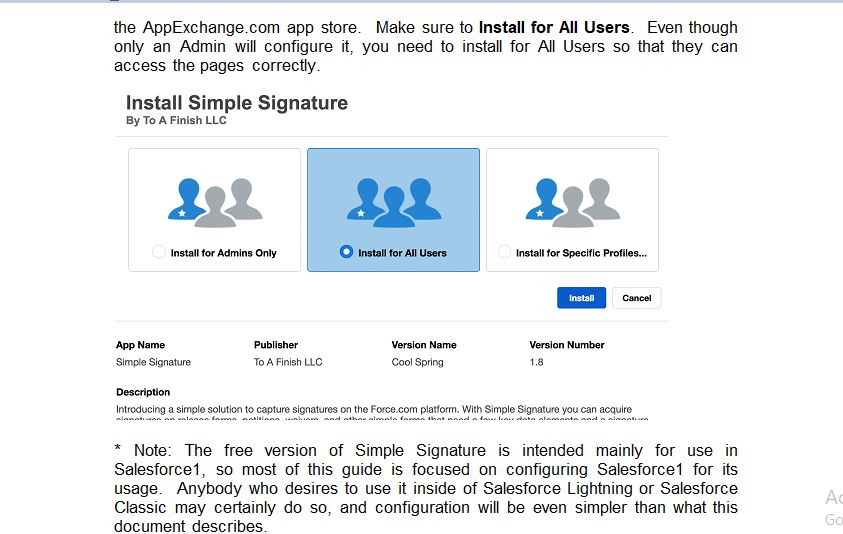
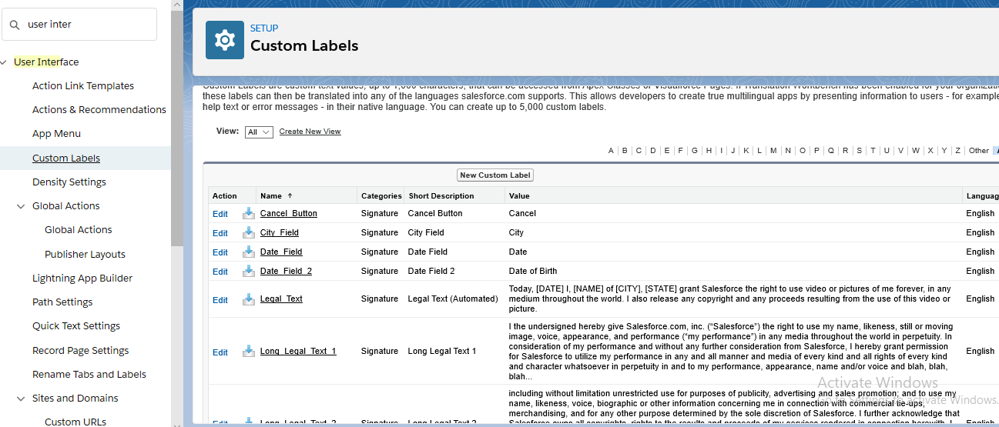
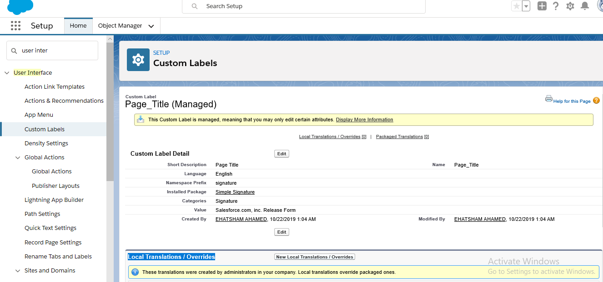
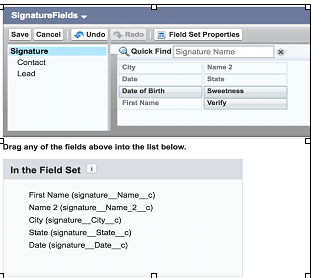

# Basic Configuration                                                                                       ##Chapter 2
>The steps necessary to set up the app for full use
# T
he initial steps in the configuration are completed by first installing the package from the AppExchange.com app store. Make sure to Install for All Users. Even though only an Admin will configure it, you need to install for All Users so
that they can access the pages correctly.

> Adding the Signature Form to Salesforce1
The first thing you will want to do is configure the Simple Signature form to show up on your Salesforce1 mobile apps. 
⦁ Make sure you are in the “ salesforce Lighning ” web version of Salesforce1, with Admin permissions.
⦁ At the top-right of the page click on Setup-->Apps-->Mobile Apps-->  Salesforce Navigation. 
⦁ Select “β Sign” from the pages on the left, and use the arrow key to move it to the items on the right.  Position it near the top so that it isn’t lost.
⦁ Press the Save button.
⦁ Now log into Salesforce and verify that you can, in fact, see the “Sign” tab. 
⦁ Test the process using the instructions in the next chapter.
⦁ Next, go back to the Lightning web version of Salesforce to continue configuring.
# Modifying the Signature Form
The next thing you need to do before beginning to use it is change what the form says in order to make it yours.
⦁ Make sure you are in the “Lightning” web version of Salesforce, with Admin permissions.
⦁ At the top-right of the page click on Setup-->  user interface  -->  Custom Labels.

⦁ Find and then click on the Name of the Page_Title custom label.
⦁ You will then be presented with a page where you can create a “Translation” for this particular item.  To do so, press the New button.

> * Note: If you do not see the “Translations” area shown in the screenshot above, go to Setup after that go to  Quick find box and type Translation Workbench  and then selectTranslation Settings and turn it on.  You should choose “English” or the native language of the users who will be using the form.
⦁ Select a Language, typically “English” or the default language your users will be using, and then type in the Title you want at the top of the form.  Press the Save button, then click on the “Master Label” link, and you will see that this title is now a part of the form.
⦁ If you have users with Salesforce set to a different language, you will need to repeat steps 4-5 for each of those languages.  If you do not, then they will default to seeing the title “Salesforce.com, Inc. Release Form”.
⦁ Now, go back to Step 3 and this time click on the Long Legal Text 1 item.  This is the text that will go under the title of the form, and before the fields and signature.  If you can fit it all in, then go ahead and do so, if not you can add text in the Long Legal Text 2 item.  Repeat Steps 4-6.

⦁ Now do the same Steps 3-6 for any other elements you wish to change on the form.
⦁ To remove fields, or add custom fields to the form, go to Setup  Create  Objects and then click on the Signature object. 
⦁ Scroll down to the “Field Set” section and click “Edit” on the SignatureFields field set.  You can now remove fields, reorder them, or add new fields to the form by dragging them down into the field set.
⦁ Once you are done, go back to Salesforce lightning  and test the “Sign” tab, making sure that your entire wording is now as you wish it to be.
> * Note: It is important to get this right before you start using the app, especially if you are using it for legal purposes.  When somebody signs and saves the record, the wording they agreed to is copied onto the record, so it is important that the wording be right before you start taking signatures.
## Adding Fields to the Signature Form
Using the steps above, you can add the fields that come with the form into the page.  However, you can add as many custom fields to the form as you desire.
⦁ Go to Setup  , click on object management and select Signature and the click the “New” button to add fields.  Repeat as necessary.
### Read-Only Fields (Optional)
If the Signature page is being called from a parent object (Opportunity, Contact, etc.), sometimes you might want read-only fields on the form. This gives the signer surety of what he or she is signing, and provides a better user experience.
⦁ Still in the Signature object, create any needed read-only field as formulas that pull data from the parent object (object from step #1.)  For example, if the parent object is the standard Opportunity object, and you want to pull in the Opportunity Name as read-only into the signature form, then create a formula field like this:

⦁ Once you’ve added all the fields you want, scroll down to the “Field Set” section and click “Edit” on the SignatureFields field set.  You can now remove fields, reorder them, or add new fields to the form by dragging them down into the field set.
⦁ Once you are done, go back to Salesforce lightning  and test the “Sign” tab, making sure that your entire wording is now as you wish it to be.

# Connecting to a Parent Object
 By default Signatures are stand-alone, but you can connect them to any object like Contracts, Orders, Cases or any other object.  Instructions to do so are below using the Contact object as an example:
 
⦁ Make sure you are in the “Lightning Salesforce ” web version of Salesforce, with Admin permissions.
⦁ At the top-right of the page click on Setup  after that click on object manager then click on Signature.
⦁ In the Fields and relationship section, press the New button and create a Lookup field to the object you want to have as the Signature parent.  (You can do more than one.)  Contact is already done for you.
⦁ Now scroll down to the Buttons, Links and Actions section, and click on the New Button or Link button.
⦁ Enter “New Signature” for the Label and then select List Button as the Display Type (and unselect the Display Checkboxes option).
⦁ For the Behavior you can select what you think is best, and for the Content Source, choose URL.  Your screen should be something like this
