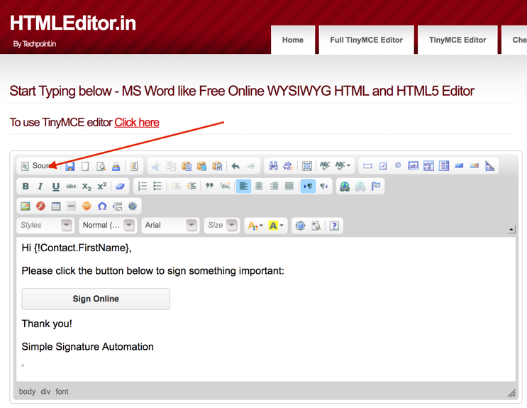

# Email Template Setup

This will help you configure the two Email Templates that go out as a part of the Signature Request process.  The confirmation email is straight forward and will not be covered in this implementation guide, but the request email is a bit more complicated and needs to be configure.

1. <b>Change the header logo</b>  (Optional) In Lightning, you can go to Setup > Email > Letterheads to edit the "Simple" letterhead and add your logo and other information.  In Classic, you can go to Setup > Communication Templates > Letterheads to edit the "Simple" letterhead and add your logo and other information.
2. <b>Browse to the Email Template Folder</b>  In Lightning, go to Setup > Email > Classic Email Templates and open the Simple Signature folder.  In Classic, go to Setup > Communication Templates > Email Templates and open the Simple Signature folder.
3. <b>Open the Email Template</b>  Click on the email template called "EmailSignature".  This is the email that you need to edit.  Once in the email, click on the "Edit HTML Version" button.
4. <b>Edit the Email Template Content</b> Update the Subject Line to say what you want it to say, and then click inside of the email body and select all of the content.  Use the Ctrl+A key combination or use whatever way you are best comfortable to ensure that you have selected ALL of the content.  Now, CUT the content to the clipboard, leaving the email completely blank.  Do not save it.
5) Go over to your favorite HTML editing program.  If you do not have one, then you can use a free [HTML editor online](http://htmleditor.in)  Delete any content currently in the window, and then PASTE from the clipboard the content you cut in step #4.  If you are using the online editor, it should look like this:



6. Now click on the Source button in the editor, so that you can now see the code that is behind the scenes.  You need to do this because you have to edit the URLs in the links.
7. Find the two places in the code where the following URL is found:

```
simplesignature-developer-edition.na30.force.com
```

and replace it with the Site URL you pulled back in the [Site Setup](SiteSetup.md) section.  Note that you should leave the http:// at the beginning, and the / plus whatever is after that at the end.  You are only replacing the middle section, which directs it to your own Salesforce org.

8. Now click the Source button again to switch out of Code mode, and again select ALL content in that window.  Copy or Cut it to the clipboard.
9. Switch back to Salesforce, go to the email that should be blank, and Paste the content into the HTML Email Content area.

<i>* Note that you might see a tiny square, or what looks like blank space around the button.  Do not remove that square.  It is a 1x1 image that is used to track when the email is opened.  <b>Unless you understand this, use the above instructions to edit the email and not the standard Salesforce edit function.</b></i>

10. Make any other changes you want to the email.  This will be what the custom sees when the signature request button is pressed, so you want them to understand what you are asking for, and respond accordingly.  Please note that an unsigned version of the PDF you are requesting them to sign might be attached to the email, so you might want to say something about it.
11. Save the email.

You are now done with all the steps.  It is time to [Test](SignatureRequests.md#testing) signature requests!
