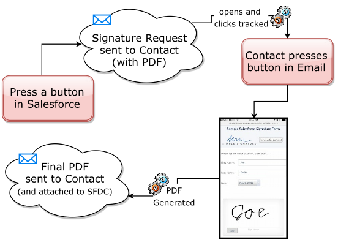

# Configuring Signature Requests
## Introduction

The first two usages of Simple Signature, where you sign forms independently in the free version, and where you can set up Signatures to be tied to a parent object, are both fairly easy to set up and use.  Requesting Signatures from a Contact in your Salesforce org is a bit more complicated, and requires several steps in order to work correctly:

1.	Create a VisualForce page to be used in the Signature process.  This is the PDF that you will want to be the final result of the signature process.
2.	Configuring the App to use this page.
3.	Creating a Signature Request button to trigger the request.

The end result of setting all of this up will be a full-cycle signature request process that can be used in one or more places at your organization.

## Steps necessary to set up Salesforce for Requesting Signatures 

Regardless of which object will be the parent of the signature, where the signature request is requested from, here are the steps you must accomplish:

- [ ] [Create a VisualForce page for the final PDF form with signature](VisualForcePDFTemplate.md)
- [ ] [Configure default settings for signature requests](ConfigureDefaultSettings.md)
- [ ] [Create a signature request button](SignatureRequestButton.md)
- [ ] [Set up the Salesforce Site for end-users to sign on](SiteSetup.md)
- [ ] [Set up the email template to go out when requesting signature](EmailTemplateForRequests.md)

> For using Signature Requests with Quotes, please see our [Quote-specific instructions](SignatureRequestsQuotes.md).

## Testing

You are now ready to test the full-cycle functionality.  Go to a record of the type you determined to be the parent of the Signature object, and press the "Request Signature" button.  After a few seconds, the contact connected to that parent object should receive an email request.  When they fill it out, they should then receive the completed PDF, with the embedded signature.

If you run into any issues, please contat us using the SS Contact page.  We will be happy to help.
