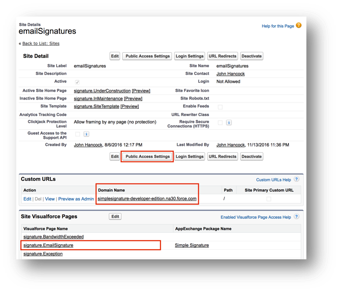

# Site Setup

These basic instructions will help you set up a Salesforce Site that allows you to process signatures from customers who do not have access to Salesforce.  It is potentially dangerous from a security standpoint as you could be opening up your Salesforce database to be read or even changed by people who are not logged in, so it is essential to know what you are doing and not do configuration changes that you do not understand.

> Again, this part of the configuration will be complicated if you do not know Salesforce Sites well.  Ask a Salesforce Administrator to help you set it up, if you haven't done it before.  If you need us to help, we can do that.  Please open a case with our support team by going to the Contact Us tab with the app and filling out the form.

1. If you don't already have a Site you want to use, <b>Create a new Site</b> In Lightning, go to the Setup > User Interface > Sites and Domains > Sites and create a new Site.  In Classic, go to the Setup > Develop > Sites and create a new Site.  If you have not set up your Domain Name it will ask you to do this before you can create a site.
1. The site you set up can be called anything you like, and the critical items to consider are as follows:
   1. You will need to know the Site URL.  You will need this in the next step, so copy this to a text file for later use.
   1. In the Public Access Settings, you will need to give this Site user access to the Signature object, as well as all of the fields that you are using.  It is a good idea to initially give it access to ALL of the fields, and then remove the ones that you think are not necessary, testing as you go so that you will know for sure when one of them is needed.
   1. You will need to add the following pages into the Site VisualForce Pages, along with any custom pages you want to use in this process.

| VisualForce Pages to Add |
|--------------------------|
| Signature.Signature |
| Signature.EmailSignature (only for older installs) |
| Signature.PartnerSignature (only for Professional users) |
| Signature.TrackEmail |
| Signature.TrackPartnerEmail |

Now with your Site URL in hand, proceed to the next step of [Setting up the Email Template](EmailTemplateForRequests.md).  Keep in mind that you might have to come back to this one in order to adjust the security of the site after you test following the next section. 
